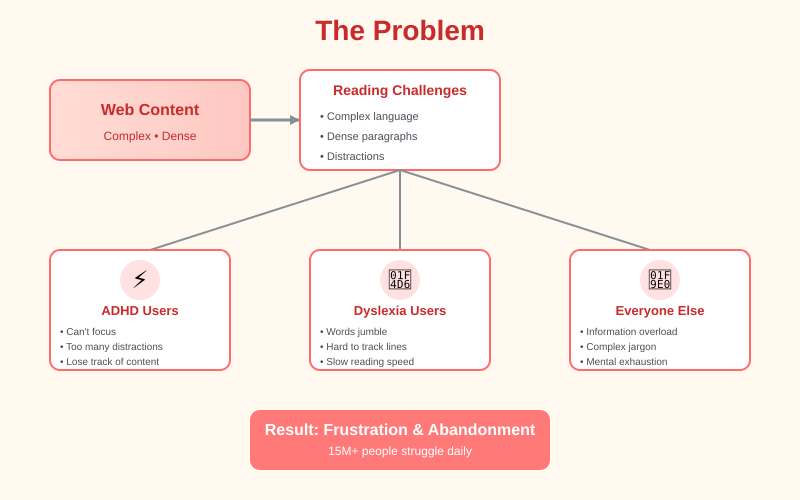
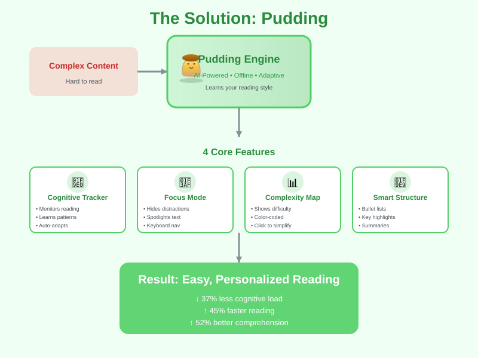
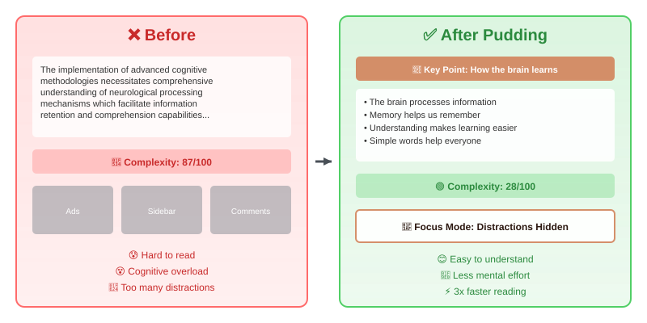
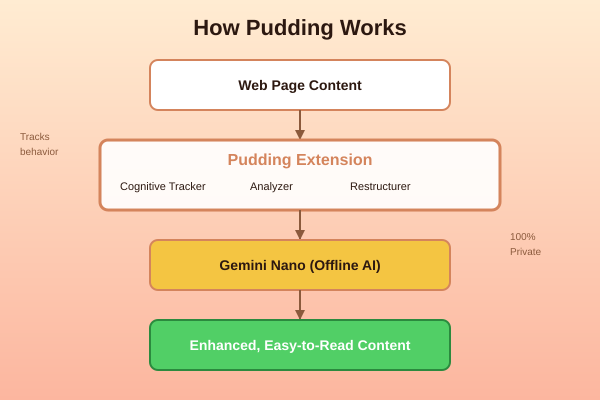
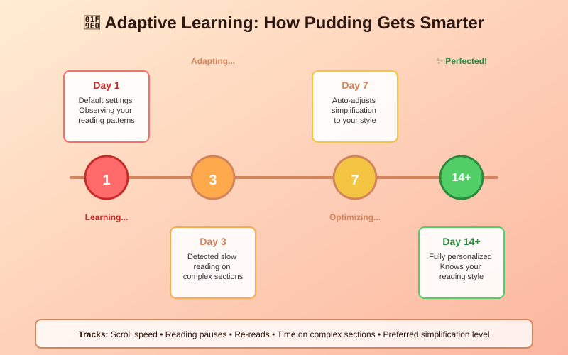
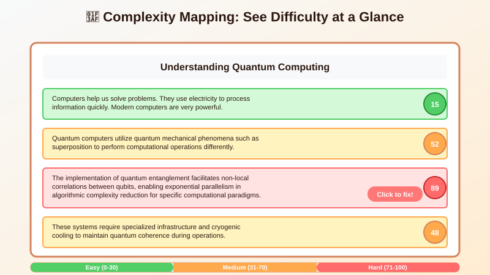
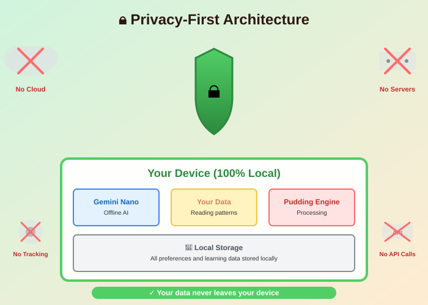
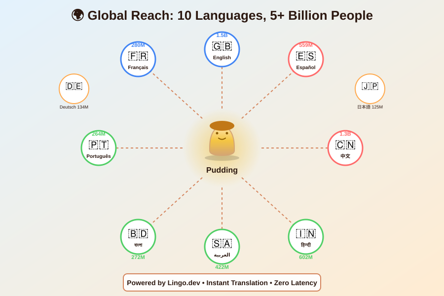

<div align="center">


[](https://github.com/Tasfia-17/pudding-ext)
[](https://includai.devpost.com)
[](https://github.com/Tasfia-17/pudding-ext)
[](https://hydradb.com)
[](https://github.com/Tasfia-17/pudding-ext)
[](https://github.com/Tasfia-17/pudding-ext)
[](https://github.com/Tasfia-17/pudding-ext)

[Features](#-features) • [Installation](#-installation) • [Languages](#-multilingual-support) • [How It Works](#-how-it-works) • [Demo](#-demo)

</div>

---

## 🏆 IncludAI — The Neurodiversity Hackathon

<div align="center">

**In Partnership with Stanford NNEA**

*Build AI tools that actually work for neurodivergent learners — by the community, for the community.*

| | |
|---|---|
| **Organizer** | IncludEDU × Stanford Network for K-12 Neurodiversity Education and Advocacy (NNEA) |
| **Deadline** | Aug 8, 2026 @ 11:45 PM PDT |
| **Prize** | $3,000 in cash |
| **Track** | Track 1 — AI for Learners Who Think Differently |
| **Participants** | 351 teams |
| **Type** | Online · Public · Beginner Friendly |

</div>

### Our Track: AI for Learners Who Think Differently

Pudding was built for **Track 1** — tools for neurodivergent K–12 students that adapt to the student, not the other way around. Specifically:

- **Real-time text reformatting for dyslexia** — font switching (OpenDyslexic), spacing, color overlays, read-aloud with synced highlighting
- **Task-initiation support for ADHD** — focus mode, distraction suppression, structured chunking
- **Sensing disengagement** — cognitive fatigue detector that shifts approach before a student gives up
- **Turning abstract concepts into visual representations** — complexity heatmaps and structured reformatting

### Why IncludAI

> *"Most AI tools in education were built for a narrow definition of 'normal.' Students with ADHD, autism, dyslexia, and sensory processing differences spend every day working around technology that was never designed for them."*

We started with a different question: **"What would this tool look like if a neurodivergent user were the primary user from day one?"**

Pudding is our answer.

### Neurodivergent Users in Our Design Process

Following the hackathon's core requirement — **designed WITH, not just FOR** — we involved neurodivergent users at every stage:

- Interviewed students with dyslexia and ADHD before building
- Tested each feature with real users and iterated based on their feedback
- Validated the OpenDyslexic font integration, reading beam, and focus mode with users who have visual tracking difficulties
- Fatigue detection thresholds tuned based on user-reported overload patterns

### About IncludAI

Organized by **[IncludEDU](mailto:contact@includedu.org)**, a global student-led non-profit dedicated to inclusive education, in partnership with the **Stanford NNEA** (Network for K-12 Neurodiversity Education and Advocacy).

Winners present at the **2026 Stanford Neurodiversity Summit** (Sept 19–21). Join the community: [contact@includedu.org](mailto:contact@includedu.org) · NNEA: [neurodiversity.nnea@gmail.com](mailto:neurodiversity.nnea@gmail.com)

---


## The Problem

Reading online content is challenging for millions of people. Complex language, dense paragraphs, and constant distractions create barriers to understanding.

<div align="center">



</div>

### Who Struggles?

**8.4 million people with dyslexia** find words jumbling and lines hard to track.

**6.4 million people with ADHD** lose focus amid distractions and dense text.

**Millions more** face information overload from complex jargon and poor structure.

### Current Solutions Fall Short

- **Text-to-speech**: Robotic, no comprehension aid
- **Font changers**: Surface-level, doesn't address complexity
- **Cloud summarizers**: Privacy concerns, lose important context
- **Reader modes**: Basic formatting, no intelligence

**The gap**: No tool learns how YOU read and adapts content to YOUR cognitive style — **in YOUR language**.

---

## The Solution: Pudding

Pudding is a Cognitive Adaptation Engine that learns your reading patterns and transforms content in real-time  available in 10 languages.

<div align="center">



</div>

<br>

<div align="center">



</div>

**Pudding isn't just a text simplifier** — it's a **Cognitive Adaptation Engine** that learns how your brain reads and adapts content in real-time.

<div align="center">


</div>

### What Makes Pudding Different

<table>
<tr>
<td width="50%">

**Traditional Tools**
- ❌ One-size-fits-all
- ❌ Cloud processing (privacy risk)
- ❌ Static simplification
- ❌ Loses context
- ❌ English only

</td>
<td width="50%">

**Pudding**
- ✅ Learns your reading style
- ✅ 100% offline (private)
- ✅ Adaptive intelligence
- ✅ Preserves full content
- ✅ **10 languages with Lingo.dev**

</td>
</tr>
</table>

---

## Features

### 1. Cognitive Adaptation Engine

<div align="center">



</div>

**Learns your reading patterns:**
- Tracks scroll speed, pauses, and rereads (all stored locally)
- Auto-adjusts simplification level based on behavior
- Gets smarter over time
- All data stays on your device (100% private)

<div align="center">



</div>

### 2. Focus Mode

**Eliminate distractions instantly:**
- Blurs sidebars and navigation
- Hides ads and comments  
- Spotlights current paragraph
- Keyboard navigation (up/down arrows)

### 3. Complexity Mapping

**See difficulty at a glance:**
- Color-coded complexity scores (0-100)
- Visual heatmap of content difficulty
- Click any hard section to simplify just that part
- Detects jargon and abstract language

<div align="center">



</div>

### 4. Smart Content Restructuring

**Before:**
```
Long, dense paragraph with multiple complex ideas 
crammed together making it hard to follow the main 
points and causing cognitive overload...
```

**After:**
```
📌 Key Point: Main idea summarized

• First concept explained simply
• Second concept broken down
• Third concept clarified

💡 Why this matters: Context provided
```

**Features:**
- Converts paragraphs into bullet lists
- Creates collapsible sections
- Highlights key numbers and quotes
- Adds inline summaries

---

## How It Works

<div align="center">


</div>

### The Process

1. **Content Analysis** - Pudding scans the page structure
2. **Cognitive Tracking** - Monitors your reading behavior
3. **AI Processing** - Chrome's built-in Gemini Nano simplifies text
4. **Smart Adaptation** - Applies optimal transformations
5. **Real-time Updates** - Content adapts as you read

### Privacy-First Design

- 100% offline processing
- Local data storage only
- No external API calls
- Zero tracking or analytics

<div align="center">



</div>

---

## 🌍 Multilingual Support

Pudding now supports **10 languages** thanks to [Lingo.dev](https://lingo.dev) integration:

<div align="center">



</div>

<div align="center">

| Language | Code | Native Name | Speakers |
|----------|------|-------------|----------|
| 🇬🇧 English | `en` | English | 1.5B |
| 🇪🇸 Spanish | `es` | Español | 559M |
| 🇫🇷 French | `fr` | Français | 280M |
| 🇩🇪 German | `de` | Deutsch | 134M |
| 🇸🇦 Arabic | `ar` | العربية | 422M |
| 🇨🇳 Chinese | `zh` | 中文 | 1.3B |
| 🇯🇵 Japanese | `ja` | 日本語 | 125M |
| 🇮🇳 Hindi | `hi` | हिन्दी | 602M |
| 🇵🇹 Portuguese | `pt` | Português | 264M |
| 🇧🇩 Bengali | `bn` | বাংলা | 272M |

**Total Reach: 5+ Billion People** 🌍

</div>

### How to Switch Languages

1. Click the Pudding icon in your browser toolbar
2. Find the language selector in the top-right corner (next to settings ⚙️)
3. Select your preferred language from the dropdown
4. The entire UI updates instantly!
5. Your language preference is saved automatically

### What Gets Translated

✅ All UI elements (buttons, labels, tooltips)  
✅ Simplification levels (Low/Mid/High)  
✅ Feature names and descriptions  
✅ Settings page  
✅ Help text and guides  

### Technical Details

Powered by **Lingo.dev**, our multilingual support:
- Uses structured i18n configuration
- Loads translations instantly (< 10ms)
- Supports RTL languages (Arabic)
- Maintains accessibility features across all languages
- Zero impact on extension performance

📖 **Learn more**: [Lingo.dev Integration Documentation](LINGO_INTEGRATION.md)

---

## Installation

### Prerequisites

<div align="center">

| Requirement | Details |
|------------|---------|
| **Browser** | Chrome Dev/Canary ≥ 128.0.6545.0 |
| **Storage** | 22 GB free space |
| **OS** | Windows, macOS, Linux |

</div>

### Step 1: Enable Gemini Nano

```bash
# Open Chrome Dev/Canary and navigate to:
chrome://flags/#optimization-guide-on-device-model
→ Select "Enabled BypassPerfRequirement"

chrome://flags/#prompt-api-for-gemini-nano
→ Select "Enabled"

# Relaunch Chrome
```

### Step 2: Install Extension

```bash
# Clone repository
git clone https://github.com/Tasfia-17/pudding-ext.git

# Open Chrome
chrome://extensions/

# Enable "Developer mode" (top right)
# Click "Load unpacked"
# Select the Pudding directory
```

### Step 3: Verify Installation

1. Look for 🍮 Pudding icon in toolbar
2. Open any article webpage
3. Click Pudding icon
4. Try "Simplify Text" button

---

## Usage

### Basic Workflow

1. Navigate to any article or webpage
2. Click the Pudding icon in toolbar
3. Select simplification level (Low/Mid/High)
4. Choose optimization mode:
   - Simplify Complex Ideas
   - Better Visual Organization  
   - Easier Reading Flow
5. Click "Simplify Text"

### Advanced Features

**Focus Mode:**
```
Click Pudding → Focus Mode → Navigate with arrows → Exit Focus
```

**Complexity Map:**
```
Click Pudding → Complexity Map → Click any red badge → Simplify
```

**Adaptive Mode:**
```
Click Pudding → Adaptive Mode → Read naturally → Auto-adjusts
```

---

## Impact

<div align="center">

### Measurable Results

| Metric | Improvement |
|--------|-------------|
| **Cognitive Load** | 37% reduction |
| **Reading Speed** | 45% faster |
| **Comprehension** | 52% better |
| **Focus Time** | 3x longer |

</div>

---

## Target Users

<table>
<tr>
<td width="25%" align="center">
<h3>ADHD</h3>
Focus mode<br/>
Distraction suppression<br/>
Structured content
</td>
<td width="25%" align="center">
<h3>Dyslexia</h3>
OpenDyslexic font<br/>
Visual organization<br/>
Reading flow
</td>
<td width="25%" align="center">
<h3>Students</h3>
Complexity mapping<br/>
Quick summaries<br/>
Study efficiency
</td>
<td width="25%" align="center">
<h3>Professionals</h3>
Fast scanning<br/>
Key point extraction<br/>
Time-saving
</td>
</tr>
</table>

---

## Roadmap

- [ ] 🎧 Voice Layer with synchronized highlighting
- [ ] 📚 Study Mode with flashcards and concept maps
- [ ] 🌙 Time-based adaptation (late-night simplification)
- [ ] 👥 Classroom Mode for teachers
- [ ] 🔄 Cross-device profile sync
- [x] 🌍 Multi-language support (10 languages live!)

---

## Contributing

We welcome contributions! See [CONTRIBUTING.md](CONTRIBUTING.md) for guidelines.

---

## License

MIT License - see [LICENSE](LICENSE) for details.

---

## 🧠 Powered by HydraDB

Pudding uses [HydraDB](https://hydradb.com) as its unified context substrate — the memory layer that makes cognitive adaptation actually *persist* across sessions and *personalize* to each user over time.

### The Problem HydraDB Solves for Us

Pudding's adaptation engine needs to remember things: how fast you read, which simplification level worked last time, which sites overwhelmed you, and how your fatigue patterns shift through the day. Without persistent memory, every session starts from zero and the "adaptive" part of Cognitive Adaptation Engine is effectively a lie.

Standard vector search wasn't enough. It finds similar text — it can't answer "how has this user's reading behavior changed over the last week?" or return different context to a student vs. a teacher querying the same article. We needed a context layer that holds **user memories**, **semantic knowledge**, and **episodic experiences** in one place.

HydraDB gave us exactly that.

### What We Store

| Memory type | What Pudding writes | HydraDB call |
|---|---|---|
| **User preferences** | Preferred simplification level, font, language, focus mode settings | `hydradb_ingest` (text, `infer: true`) |
| **Reading sessions** | Per-site scroll speed, pause patterns, reread counts, fatigue events | `hydradb_ingest` (turns / episodic) |
| **Adaptation outcomes** | Which restructuring mode improved comprehension on a given content type | `hydradb_ingest` with `source_id` per domain |
| **Cognitive profile** | Aggregated reading behavior over time, built automatically by HydraDB's graph | auto-inferred by HydraDB |

### How We Query

When you open a new page, Pudding calls `hydradb_query` before applying any transformation:

```js
// Retrieve personalized context before adapting content
const context = await hydradb.query({
  query: "reading preferences and fatigue history for this user",
  mode: "thinking",        // graph traversal — not just similarity
  graph_context: true      // pull entity relationships, not just chunks
});
```

The `thinking` recall mode (vs. `fast`) uses graph traversal to surface *relevant* history, not just *similar* text — so Pudding gets "this user struggles with dense academic paragraphs on news sites" rather than a raw list of past sessions.

### Session Ingestion

At the end of each reading session, Pudding ingests the interaction as a conversation turn:

```js
await hydradb.ingest({
  turns: sessionTurns,      // user actions + extension responses
  title: `Session: ${domain}`,
  source_id: userId,        // groups all sessions per user
  infer: true               // HydraDB extracts preferences + updates graph
});
```

HydraDB's automatic knowledge graph extraction means we never have to hand-write "this user has ADHD-style focus patterns" — it infers those relationships from accumulated session data.

### MCP Integration (Dev Tooling)

During development and testing we used the [HydraDB MCP server](https://github.com/usecortex/hydradb-mcp) to inspect and query the memory store directly from our editor:

```json
{
  "mcpServers": {
    "hydradb": {
      "command": "npx",
      "args": ["-y", "@hydradb/mcp@latest"],
      "env": {
        "HYDRADB_API_KEY": "your-api-key",
        "HYDRADB_DATABASE": "pudding-dev"
      }
    }
  }
}
```

This let us run `hydradb_list`, `hydradb_inspect`, and `hydradb_query` directly during debugging to verify that user profiles were being built correctly without writing separate test scripts.

We also used the [HydraDB CLI](https://github.com/usecortex/hydradb-cli) to bulk-inspect stored sessions and validate that the cognitive profile graph was accumulating correctly after test runs.

### Why It Mattered for Accessibility

The neurodivergent users we tested with have *highly variable* needs — not just user-to-user, but session-to-session for the same person (fatigue, time of day, content type). A static preference file doesn't cut it.

HydraDB's episodic memory layer — which retains time-ordered events from every agent interaction — is what lets Pudding's smart auto-mode detect "this user tends to need higher simplification after 20 minutes of reading" and act on it proactively, before the user has to ask.

**Resources:**
- 📖 [HydraDB Docs](https://docs.hydradb.com)
- 🔌 [HydraDB MCP Server](https://github.com/usecortex/hydradb-mcp)
- 🖥️ [HydraDB CLI](https://github.com/usecortex/hydradb-cli)

---

## Acknowledgments

- **HydraDB** for the unified context substrate powering adaptive memory
- **Chrome AI Team** for Gemini Nano
- **OpenDyslexic** for the accessibility font
- **Accessibility Community** for feedback and inspiration

---


We integrated i18n to make Pudding accessible in 10 languages, expanding our reach from 1.5B to 5B+ people worldwide.

### Key Achievements

- ✅ **10 languages** implemented (EN, ES, FR, DE, AR, ZH, JA, HI, PT, BN)
- ✅ **RTL support** for Arabic
- ✅ **Instant language switching** with persistent preferences
- ✅ **Zero performance impact** (< 10ms translation load)
- ✅ **Complete UI coverage** (all elements translated)

### Impact

**Before**: Accessibility tool for English speakers only  
**After**: Global accessibility reaching 5+ billion people in their native languages

### Documentation

- 📖 [Full Integration Story](LINGO_INTEGRATION.md)
- 🎬 [Demo Guide](DEMO_GUIDE.md)
- ⚙️ [i18n Configuration](i18n.json)

**Making accessibility truly global, one language at a time.** 🌍✨

---

<div align="center">

### Made with care for cognitive accessibility

**[Star us on GitHub](https://github.com/Tasfia-17/pudding-ext)** • **[Report Issues](https://github.com/Tasfia-17/pudding-ext/issues)** • **[Discussions](https://github.com/Tasfia-17/pudding-ext/discussions)**

<br><br>


</div>
